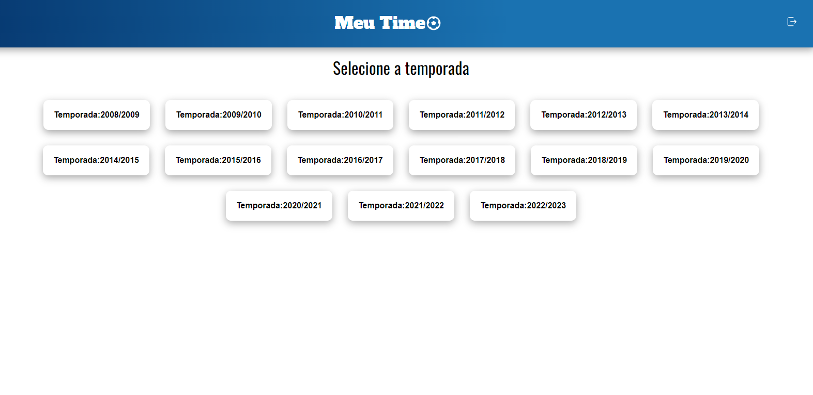

<h1 align="center": center">Meu Time</h1>
<h2>1 - Tela de Autenticação:</h2>

Nessa tela o usuário só poderar logar com a Key disponibilizada no <a href="https://dashboard.api-football.com/">API Sports</a> 
e abaixo disponiliza um link que redireciona o usuário para o site.

Quando inserida a Key fica armazenada no Local Storage do usuário, e utilizando o useEffect, é verificado se a key é válida e mantendo o usuário logado.
Quando não nenhum dado armazenado automanticamente o usuário volta para a tela de Login.

<h2>2 - Tela de Dashboard:</h2>

Na tela de Dashboard, contém todos os países da API, abaixo contém um botão para poder renderizar mais países na tela. Acima há um input onde o usuário pode buscar o país que deseja.

Para isso, utilizei o useEffect com o Axios para regastar dados da Api.

<h2>3 - Tela de Temporadas:</h2>

Na tela de Temporadas, o usuário seleciona a temporada que deseja para que possa dá continuidade na aplicação.

<h2>4 - Tela de Ligas:</h2>

Quando informado o país e a temporada, usamaos o useEffect com os parâmetros de país e temporadas para que seja possível renderizar as ligas disponíveis, os parâmetros são passados de um componente para o outro usando o useParams.

<h2>5 - Tela de Times:</h2>

Na tela de Times, funciona basicamente da mesma forma que na Tela de Ligas, os parâmetros são passados pelo o useParams, como id da Liga, da Temporada e nome do País dos times disponíveis.

<h2>6 - Tela de Time:</h2>

Sendo informado todos os parâmetros, como País, Temporada, Liga e Time. na Tela de Time contém as seguintes informações:

<ul>
    <li>Lista de Jogadores(contendo nome, idade e nacionalidade).</li>
    <li>A formação mais utilizada na Temporada do Time.</li>
    <li>A tabela de Resultados do Time na Temporada Selecionada.</li>
    <li>Um gráfico com a quantidade de gols marcados por tempo de jogo.</li>
</ul>

A aplicação somente renderiza se todos os parâmetros forem seguidos pela a ordem apresentada

<h3>Tecnologias usadas:</h3>
<ul>
    <li>React + TypeScript</li>
    <li>Axios</li>
    <li>Google Charts(para gráficos)</li>
    <li>React-Router-DOM (para rotas)</li>
</ul>